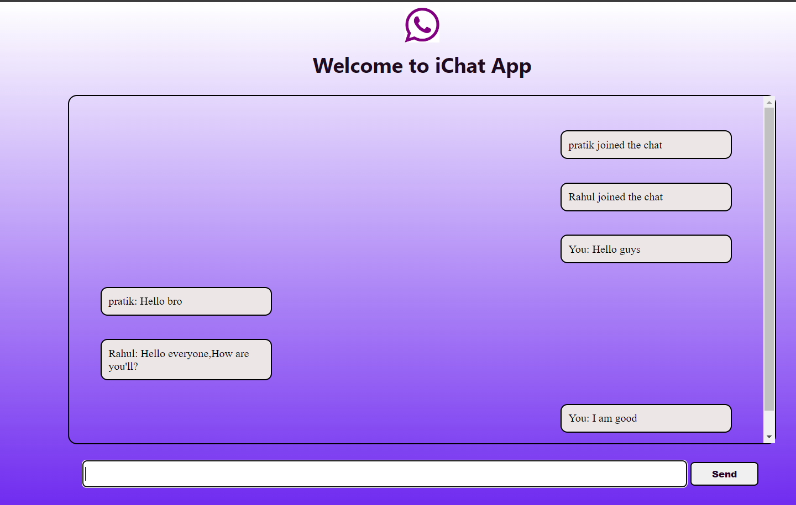

# iChat webSocket App



### a Realtime Chat Application Using NodeJs and SocketIO 


## Installation

1. Clone this repository:

    ```bash
    git clone https://github.com/pratiks05/iChat-Socket.IO.git
    cd .\ nodeServer\
    ```

2. Install dependencies and Running:

    ```bash
    npm init
    npm i socket.io
    ```
   